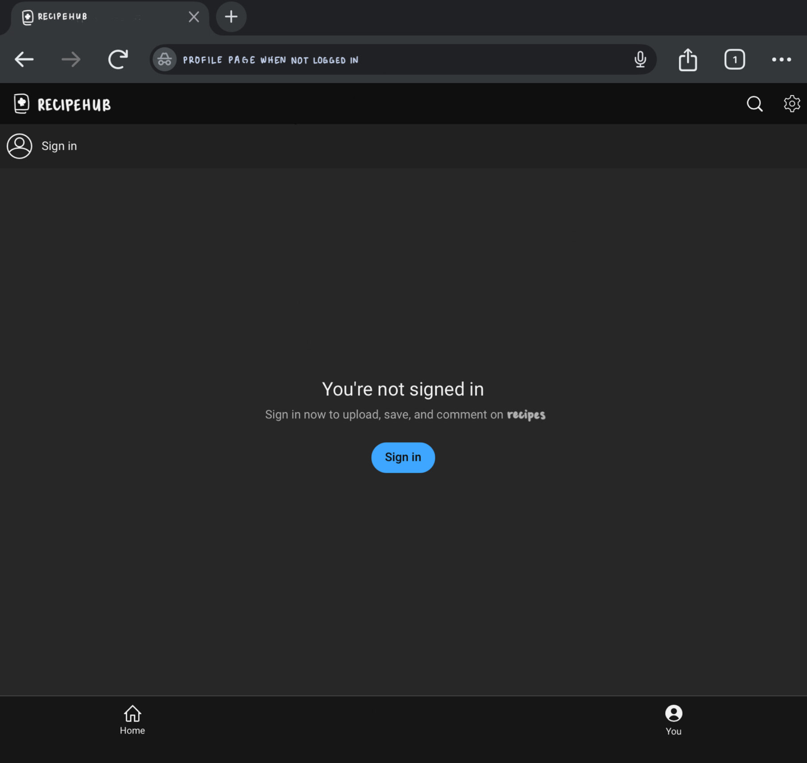
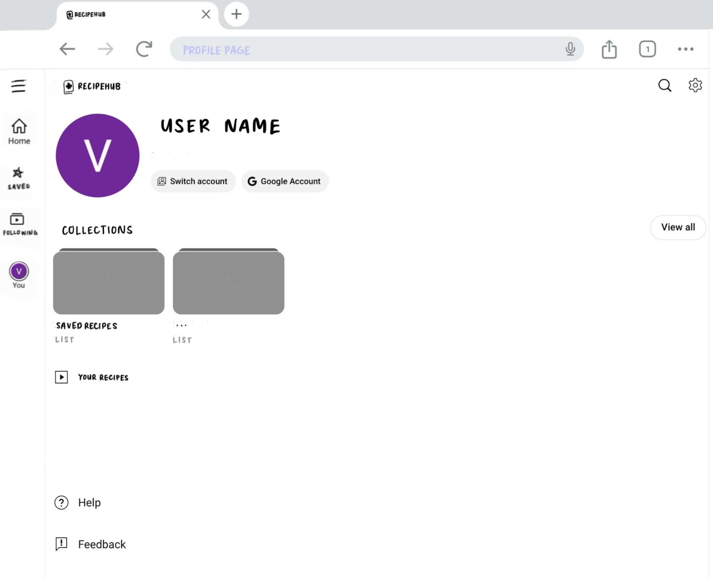
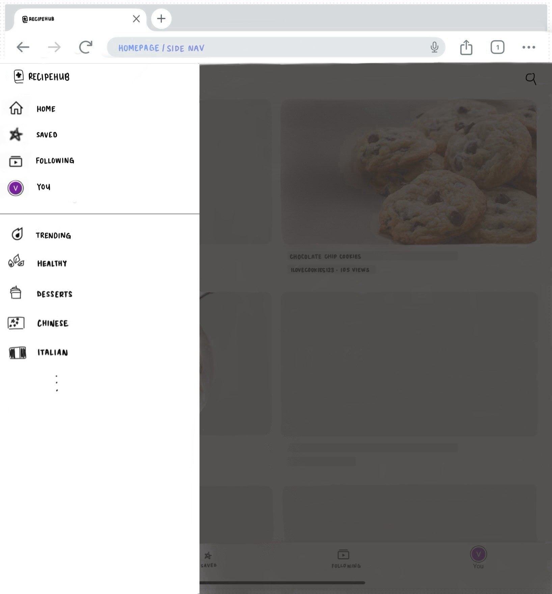
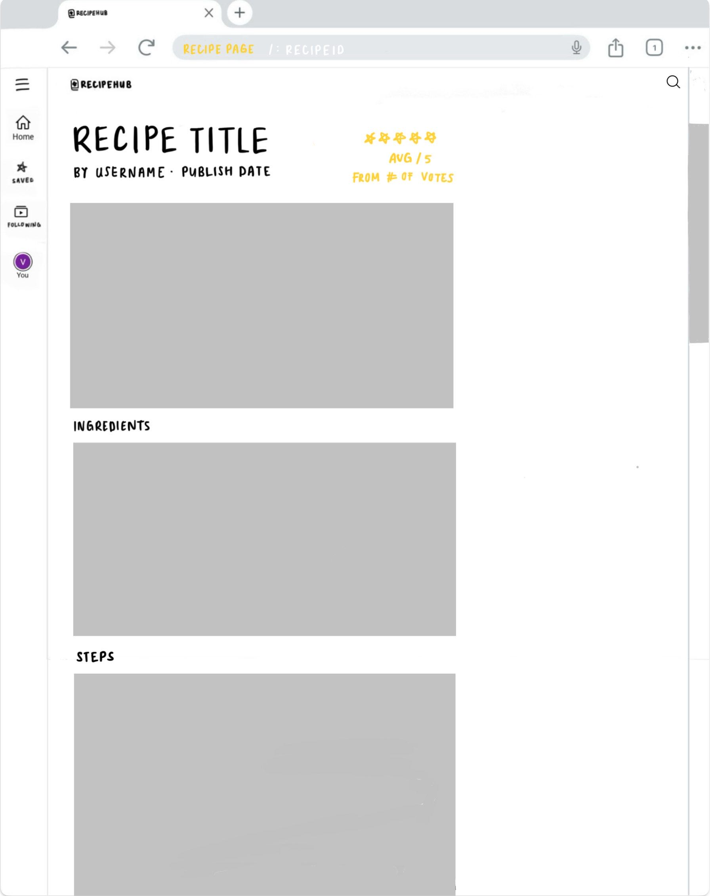
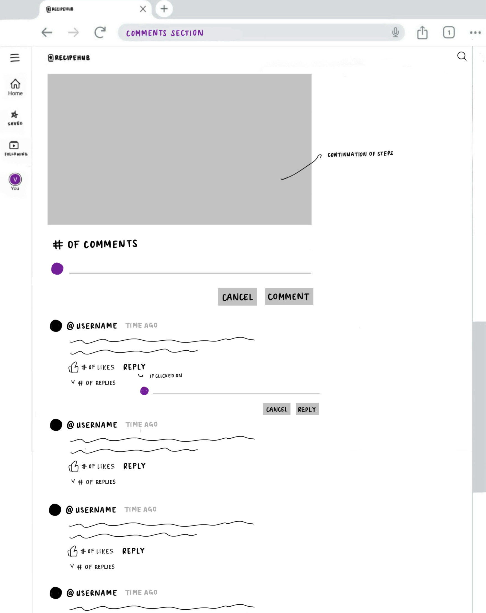

# Recipehub

**Recipehub** is a full-stack recipe sharing website where users can register, log in, and fully manage their own recipes by creating, editing, saving, and sharing them. The homepage will showcase recipes uploaded by the community, allowing users to browse, rate, comment, and search or filter through the collection. 

As an upcoming feature, users will be able to paste recipe blog URLs and automatically extract and summarize the ingredients and steps -- skipping the long story intros.

---

## Live Demo

🚧 Link coming soon -- will be deployed on Vercel once MVP is complete

---

## Screenshots

🚧  Screenshots will be added once core pages are built:
- Homepage
- Recipe detail page
- User profile page

---

## UI Preview
Before development, I created rough UI mockups using screenshots and annotations to plan the layout and user flow.

<h4>Sign-in Page</h4>



<h4>Profile Page</h4>



<h4>Homepage</h4>


<h4>Side Nav</h4>



<h4>Recipe Page</h4>



<h4>Rate Recipe (Recipe Page)</h4>


<h4>Comments Section (Recipe Page)</h4>



*Note: UI sketch was inspired by Youtube's layout

---

## Features

- User Authentication (email or google)
- Create, edit, and save recipes
- Rate and comment on recipes
- Search and filter through saved or uploaded recipes
- Paste recipe blog URLs to auto-extract ingredients and steps *(coming later)*

---

## Tech Stack

- **Frontend**: React (via Next.js)
- **Backend**: Next.js API Routes
- **Database**: MongoDB Atlas
- **Authentication**: NextAuth.js
- **Styling**: Tailwind CSS

---

## Getting Started

### Prerequisites

- Node.js >= 18
- npm or yarn
- MongoDB (local or atlas)
- `.env.local` file with required environment variables

### 1. Clone the Repo

```bash
git clone https://github.com/vianalin13/recipehub.git
cd recipehub
```

### 2. Install Dependencies

npm install

### 3. Run the Dev Server

npm run dev
The app should now be running at http://localhost:3000
